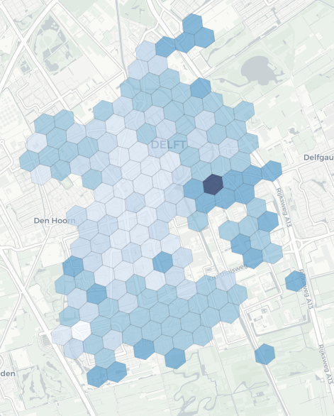
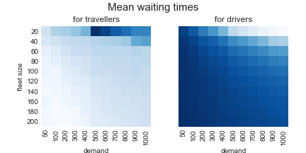
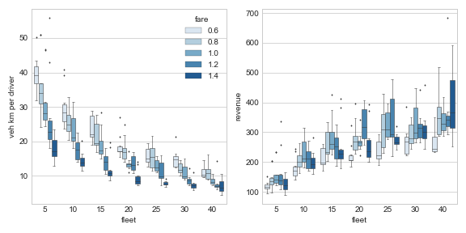

# MaaSSim

* (c) TU Delft, Critical MaaS ERC grant
* contributors: Rafal Kucharski, Oded Cats, Arjan de Ruijter ....

[](https://www.codefactor.io/repository/github/rafalkucharskipk/maassim)
[](https://travis-ci.org/RafalKucharskiPK/MaaSSim)
[](https://coveralls.io/github/RafalKucharskiPK/MaaSSim?branch=master)


MaaSSim is an agent-based simulator reproducing the transport system dynamics used by two kind of agents: (i) travellers, requesting to travel from their origin to destination at a given time, and (ii) drivers supplying their travel needs by offering them rides. The intermediate agent, the platform, allows demand to be matched with supply. Both supply and demand are microscopic. For supply this pertains to explicit representation of single vehicles and their movements in time and space (detailed road network graph), while for demand this pertains to exact trip request time and destinations defined at the graph node level.
Agents are decision makers, specifically, travellers may decide which mode they use (potentially quitting using simulated MaaS modes) or reject the incoming offer. Similarly, driver may opt-out from the system (stop providing service) or reject/accept incoming requests, moreover he may strategically reposition while being idle. All of above behaviours are modelled through user-defined modules, by default deterministic, optionally probabilistic, representing agents' taste variations (heterogeneity), their previous experiences (learning) and available information (system control). Similarly, the system performance (amongst others travel times and service times) may be deterministic or probabilistic, leading to different results' interpretations.
The simulation run results in two sets of records, one being sequence of space-time locations and statuses for simulated vehicles and the other for travellers. Further synthesized into agent-level and system-wide KPIs for further analyses.

## MaaSSim usage and functionalities at glance

```python
sim = MaaSSim.simulators.simulate(config = 'glance.json')  # run the simulation from a given configuration
sim.runs[0].trips  # access the results
params = MaaSSim.utils.get_config('glance.json')  # load configuration
params.city = "Nootdorp, Netherlands" # modify it
inData = MaaSSim.utils.load_G(inData,params)  # load the graph for a different city
sim_1 = MaaSSim.simulators.simulate(params=params) # run the simulation
params.nP = 5 # change number of travellers
inData = MaaSSim.utils.prep_supply_and_demand(inData, params)  # regenerate supply and demand
sim_2 = MaaSSim.simulators.simulate(inData=inData,params=params) # run the second simulation
print('Total waiting time: {}s in first simulation and {}s in the second.'.format(sim_1.res[0].pax_exp['WAIT'].sum(),
      sim_2.res[0].pax_exp['WAIT'].sum()))  # compare some results
space =  dict(nP=[5,10,20], nV = [5,10]) # define search space of supply and demand levels
MaaSSim.simulators.simulate_parallel(inData=inData, params=params, search_space = space, logger_level = logging.WARNING) # run parallel experiments
res = MaaSSim.utils.collect_results(params.paths.dumps) # collect results from  parallel experiments

def my_function(**kwargs): # user defined function to represent agent decisions
    veh = kwargs.get('veh', None)  # input from simulation
    sim = veh.sim  # access to simulation object
    if len(sim.runs) > 0:
        if sim.res[last_run].veh_exp.loc[veh.id].nRIDES > 3:
            return False # if I had more than 3 rides yesterday I stay
        else:
            return True # otherwise I leave
    else:
        return True # I do not leave on first day
        
sim = MaaSSim.simulators.simulate(inData=inData,params=params, f_driver_out = my_function, logger_level = logging.INFO) # simulate with my user defined function
```


## Documentation


* [Tutorial](https://github.com/RafalKucharskiPK/MaaSSim/tree/master/docs/tutorials)
* [Quickstart](https://github.com/RafalKucharskiPK/MaaSSim/blob/master/docs/tutorials/01_Quickstart.ipynb)
* [Overview](https://github.com/RafalKucharskiPK/MaaSSim/blob/master/docs/tutorials/00_MaaSSim_at_glance.ipynb)
* [Reproducible sample experiments](https://github.com/RafalKucharskiPK/MaaSSim/tree/master/docs/Experiments)
* [Configuration](https://github.com/RafalKucharskiPK/MaaSSim/blob/master/docs/tutorials/A_04_Config.ipynb)
* [Your own networks](https://github.com/RafalKucharskiPK/MaaSSim/blob/master/docs/tutorials/A_01%20NetworkGraphs.ipynb)
* [You own demand](https://github.com/RafalKucharskiPK/MaaSSim/blob/master/docs/tutorials/A_03%20Synthetic%20Demand.ipynb)
* [Developing own decision functions](https://github.com/RafalKucharskiPK/MaaSSim/blob/master/docs/tutorials/06_User_defined_functionalities.ipynb)
* [Interpreting results](https://github.com/RafalKucharskiPK/MaaSSim/blob/master/docs/tutorials/05_Results.ipynb)


# Overview




*Fig. 1 Average waiting times for travellers until the driver arrives (a) and for driver, until they get requested (b) in Delft.
Results from 20 replications of four hour simulation with 200 travellers and 10 vehicles in Delft, Netherlands. While travellers need
to wait longer in western part of the city, the vehicles wait for requests shorter there and their waiting times longest in eastern
part, where, in turn, traveller waiting times are shorter.*




*Fig. 2. Service performance for various demand and supply levels. Average waiting times for traveller (left) and drivers (right). We can see opposite diagonal trends: System performance for traveller improves with increasing supply on one hand and decreasing demand on another, as travellers are served with lower waiting times. Conversely, if demand increases and fleet size decreases, the system improves for drivers, who need to wait less before requested. Yielding an interesting competitive structure, specific to two-sided platforms. *



Fig. 4. Searching for optimal platform competition strategy, platform competes on ma market with competitor operating fleet of 20 vehicles at fare of 1.0 unit/km. We explore average vehicle kilometers per driver (a) and total platform revenues (b) resulting from varying fleet size (x-axis) and fare (per-kilometer) and 10 replications.*


*Fig. 4. Driver reinforced learning behaviour, based on previous experience and expected outcomes, they make a daily decisions to opt out, or stay in the system. Initially high supply does not allow them to reach the desired income level, so many drivers opt out, yet as the fleet size decreases, the incomes for remaining drivers increase, making it reasonable for drivers to return to the system. Depending on user-defined configuration of learning process an realistic adaptive behaviour may be reproduced *


*Fig. 5. Trace of rides for a single simulated vehicle without (a) and with pooled ride services (b). Segments marked with green were travelled with more than one traveller, segments marked with black were travelled empty. *

# Installation (recommended):

`pip install maassim`

or clone this repository
    
### dependencies
---
#### jupyterLab
   accesible from anaconda navigator

#### networkX
 graph package capable of efficient graph operations, i.e. path searches (https://networkx.github.io/documentation/networkx-1.10/reference/introduction.html)

#### osmNX (presumalby the hardest dependenciy that causes most of issues)
   allows to donwload network (road, walk, bike, ...) from OSM via into _networkX_ python format. (see: https://github.com/gboeing/osmnx#installation for installation)
   
#### pandas
   data input and output via .csv files. 
   highly flexible and light-weight replacement for SQL-like databases.
     _DataFrame_ may store tha input and output data, handle consistency in naming, fields, structures, etc.
     
#### simpy
   multi-agent real-time simulation package with highly flexible _process_. 
   It will process:
   *  _passenger_ through the day along his decisions and trips
   *  _driver_ through the day along his decisions and trips
   * interactions betwee drivers and passengers
   http://heather.cs.ucdavis.edu/~matloff/156/PLN/DESimIntro.pdf (old but thorough intro to SimPy)
   
 

## Selected features:


* _batched and event-based platform operations_: request may be either immediately assigned to the idle driver (repsectively idle driver may be immediately assigned to queued requests), or the can be *batched* i.e. matching may be performed every _n_ seconds and pooled requests may be served together (illustrated in MaaSSim_sketches/code/tests/3 Platform batched and event based.ipynb).
* _multiplatform_: each traveller may be assigned to one or more platforms (one-to-many), each driver may be assigned to only one platform (one-to-one for simplicity). Traveller simulatneously requests to all his platforms and decides to accept/reject  incoming matches, ass soon as he is matched he pops from queues of other platofrms (MaaSSim_sketches/code/tests/4 Multiplatform.ipynb).
* _shared rides_ offline matching algorithm ([ExMAS](https://github.com/RafalKucharskiPK/ExMAS)). Travellers are matched before simulation into (attractive) shared-rides, then we simulate those fixed matched rides. First traveller requests the vehicle to serve the shared ride, then they visit all the nodes along the schedule.tested for Nootdorp here: Documents/GitHub/MaaSSim_sketches/code/tests/5 Multistage schedule.ipynb surprisingly computation time does not explode in such approach.
* _stochasticity_ all the durations in the simulation may be variable, controlled via sim.vars.* , e.g. sim.vars.ride = 0.1 would mean 10% variability of travel time (further explained here: Documents/GitHub/MaaSSim_sketches/code/tutorial/16 Nondeterministicity.ipynb)
* _two-level rejects for supply and demand_ both driver and may reject to be part of the system at two levels. Driver may stop being driver and traveller may stop considering any simulated MaaS modes. This happens before the simulation starts. Or, within simulation driver may reject incoming request, as well as the traveller may reject incoming driver match.
* _two sided queues_: drivers waiting for travellers or clients waiting for vehicles, tested in MaaSSim_sketches/code/tests/1 Two sided queues.ipynb with 50veh/5pax and 50pax/5veh in Noodtorp
* _tabu_: in matching (driver is matched with traveller based on shortest distance between them, yet either one of them rejects it) the search continues for the second best match.
* _rejects_: driver and vehicle are matched based on distance (by default) by default they accept, though we can simulate that they reject: traveller rejects driver (due to price, and/or waiting time) or driver rejects traveller (due to distance to pickup etc.), tested with random reject functions on (MaaSSim_sketches/code/tests/2 Rejects.ipynb).
* _saving results_ results and input files to .zip with .csv's of: requests, vehicles, rides, trips and res. Called via _sim.dump(path)_
* _driver shifts_ each driver by default is active throughout the simulation, though he may stard and/or end later - controllable via input .csv of drivers
* _params_ one general dict with parameters, either loaded from .csv, or populated on the fly while running and modified during simulations 
* _results_ iplemented at three levels: raw, processed and aggregated. Computed for each run and described here: MaaSSim_sketches/code/tutorial/13 Results.ipynb
* _plots and charts_ currently implemented sketches to extend: map, map+origins/destinations, passenger routes, vehicle daily routes, annotated shared rides, transit paths on map, space-time diagrams of daily pax/veh routine, ...
* multithreaded runs (via _scipy.optimize.brute(nworkers = n)_) explored over the search space (including replications). Each of scenarios is stoder vis `sim.dump`)
* multiple runs supported in runner.py -> Exec(). `params.nD` iterations will be run as exemplified


