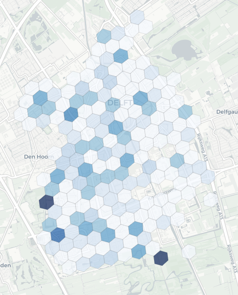
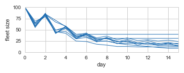
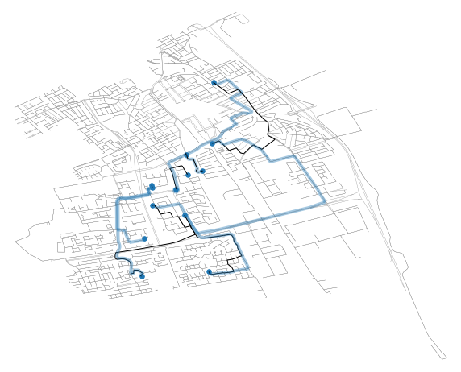

# MaaSSim
## agent-based two-sided mobility platform simulator


[](https://www.codefactor.io/repository/github/rafalkucharskipk/maassim)
[](https://travis-ci.org/RafalKucharskiPK/MaaSSim)
[](https://coveralls.io/github/RafalKucharskiPK/MaaSSim?branch=master)


MaaSSim is an agent-based simulator reproducing the transport system dynamics used by two kind of agents: (i) travellers, requesting to travel from their origin to destination at a given time, and (ii) drivers supplying their travel needs by offering them rides. The intermediate agent, the platform, allows demand to be matched with supply. Both supply and demand are microscopic. For supply this pertains to explicit representation of single vehicles and their movements in time and space (detailed road network graph), while for demand this pertains to exact trip request time and destinations defined at the graph node level.
Agents are decision makers, specifically, travellers may decide which mode they use (potentially quitting using simulated MaaS modes) or reject the incoming offer. Similarly, driver may opt-out from the system (stop providing service) or reject/accept incoming requests, moreover he may strategically reposition while being idle. All of above behaviours are modelled through user-defined modules, by default deterministic, optionally probabilistic, representing agents' taste variations (heterogeneity), their previous experiences (learning) and available information (system control). Similarly, the system performance (amongst others travel times and service times) may be deterministic or probabilistic, leading to different results' interpretations.
The simulation run results in two sets of records, one being sequence of space-time locations and statuses for simulated vehicles and the other for travellers. Further synthesized into agent-level and system-wide KPIs for further analyses.

## MaaSSim usage and functionalities at glance

```python
sim = MaaSSim.simulators.simulate(config = 'glance.json')  # run the simulation from a given configuration
sim.runs[0].trips  # access the results
params = MaaSSim.utils.get_config('glance.json')  # load configuration
params.city = "Nootdorp, Netherlands" # modify it
inData = MaaSSim.utils.load_G(inData,params)  # load the graph for a different city
sim_1 = MaaSSim.simulators.simulate(params=params) # run the simulation
params.nP = 5 # change number of travellers
inData = MaaSSim.utils.prep_supply_and_demand(inData, params)  # regenerate supply and demand
sim_2 = MaaSSim.simulators.simulate(inData=inData,params=params) # run the second simulation
print('Total waiting time: {}s in first simulation and {}s in the second.'.format(sim_1.res[0].pax_exp['WAIT'].sum(),
      sim_2.res[0].pax_exp['WAIT'].sum()))  # compare some results
space =  dict(nP=[5,10,20], nV = [5,10]) # define search space of supply and demand levels
MaaSSim.simulators.simulate_parallel(inData=inData, params=params, search_space = space, logger_level = logging.WARNING) # run parallel experiments
res = MaaSSim.utils.collect_results(params.paths.dumps) # collect results from  parallel experiments

def my_function(**kwargs): # user defined function to represent agent decisions
    veh = kwargs.get('veh', None)  # input from simulation
    sim = veh.sim  # access to simulation object
    if len(sim.runs) > 0:
        if sim.res[last_run].veh_exp.loc[veh.id].nRIDES > 3:
            return False # if I had more than 3 rides yesterday I stay
        else:
            return True # otherwise I leave
    else:
        return True # I do not leave on first day
        
sim = MaaSSim.simulators.simulate(inData=inData,params=params, f_driver_out = my_function, logger_level = logging.INFO) # simulate with my user defined function
```


## Documentation


* [Tutorial](https://github.com/RafalKucharskiPK/MaaSSim/tree/master/docs/tutorials)
* [Quickstart](https://github.com/RafalKucharskiPK/MaaSSim/blob/master/docs/tutorials/01_Quickstart.ipynb)
* [Overview](https://github.com/RafalKucharskiPK/MaaSSim/blob/master/docs/tutorials/00_MaaSSim_at_glance.ipynb)
* [Reproducible sample experiments](https://github.com/RafalKucharskiPK/MaaSSim/tree/master/docs/Experiments)
* [Configuration](https://github.com/RafalKucharskiPK/MaaSSim/blob/master/docs/tutorials/A_04_Config.ipynb)
* [Your own networks](https://github.com/RafalKucharskiPK/MaaSSim/blob/master/docs/tutorials/A_01%20NetworkGraphs.ipynb)
* [You own demand](https://github.com/RafalKucharskiPK/MaaSSim/blob/master/docs/tutorials/A_03%20Synthetic%20Demand.ipynb)
* [Developing own decision functions](https://github.com/RafalKucharskiPK/MaaSSim/blob/master/docs/tutorials/06_User_defined_functionalities.ipynb)
* [Interpreting results](https://github.com/RafalKucharskiPK/MaaSSim/blob/master/docs/tutorials/05_Results.ipynb)


# Overview





*Fig. 1 Average waiting times for travellers until the driver arrives (a) and for driver, until they get requested (b) in Delft.
Results from 20 replications of four hour simulation with 200 travellers and 10 vehicles in Delft, Netherlands. While travellers need
to wait longer in western part of the city, the vehicles wait for requests shorter there and their waiting times longest in eastern
part, where, in turn, traveller waiting times are shorter.*


*Fig. 2. Service performance for various demand and supply levels. Average waiting times for traveller (left) and drivers (right). We can see opposite diagonal trends: System performance for traveller improves with increasing supply on one hand and decreasing demand on another, as travellers are served with lower waiting times. Conversely, if demand increases and fleet size decreases, the system improves for drivers, who need to wait less before requested. Yielding an interesting competitive structure, specific to two-sided platforms. *


Fig. 4. Searching for optimal platform competition strategy, platform competes on ma market with competitor operating fleet of 20 vehicles at fare of 1.0 unit/km. We explore average vehicle kilometers per driver (a) and total platform revenues (b) resulting from varying fleet size (x-axis) and fare (per-kilometer) and 10 replications.*



*Fig. 4. Driver reinforced learning behaviour, based on previous experience and expected outcomes, they make a daily decisions to opt out, or stay in the system. Initially high supply does not allow them to reach the desired income level, so many drivers opt out, yet as the fleet size decreases, the incomes for remaining drivers increase, making it reasonable for drivers to return to the system. Depending on user-defined configuration of learning process an realistic adaptive behaviour may be reproduced *




*Fig. 5. Trace of rides for a single simulated vehicle without (a) and with pooled ride services (b). Segments marked with green were travelled with more than one traveller, segments marked with black were travelled empty. *

# Installation (recommended):

`pip install maassim`

or clone this repository
    
### dependencies
---
#### networkX
 graph package capable of efficient graph operations, i.e. path searches (https://networkx.github.io/documentation/networkx-1.10/reference/introduction.html)

#### osmNX (presumalby the hardest dependenciy that causes most of issues)
   allows to donwload network (road, walk, bike, ...) from OSM via into _networkX_ python format. (see: https://github.com/gboeing/osmnx#installation for installation)
   
#### pandas
   data input and output via .csv files. 
   highly flexible and light-weight replacement for SQL-like databases.
     _DataFrame_ may store tha input and output data, handle consistency in naming, fields, structures, etc.
     
#### simpy
   multi-agent real-time simulation package with highly flexible _process_. 
   It will process:
   *  _passenger_ through the day along his decisions and trips
   *  _driver_ through the day along his decisions and trips
   * interactions betwee drivers and passengers
   http://heather.cs.ucdavis.edu/~matloff/156/PLN/DESimIntro.pdf (old but thorough intro to SimPy)
    
----
Rafał Kucharski, 2020
